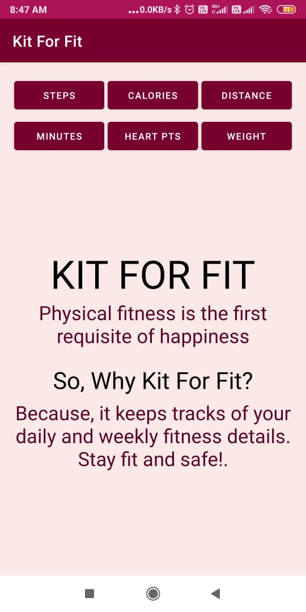
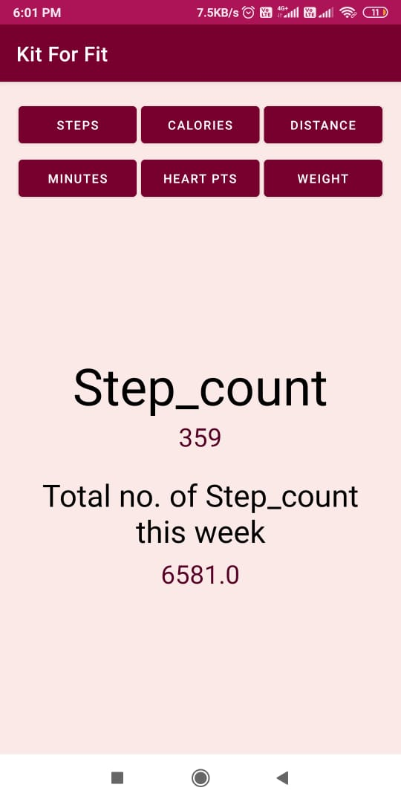
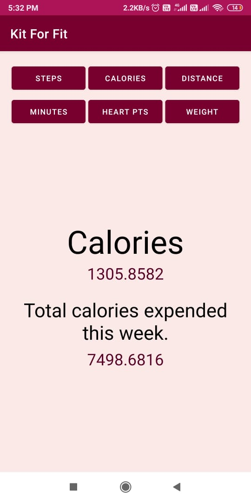
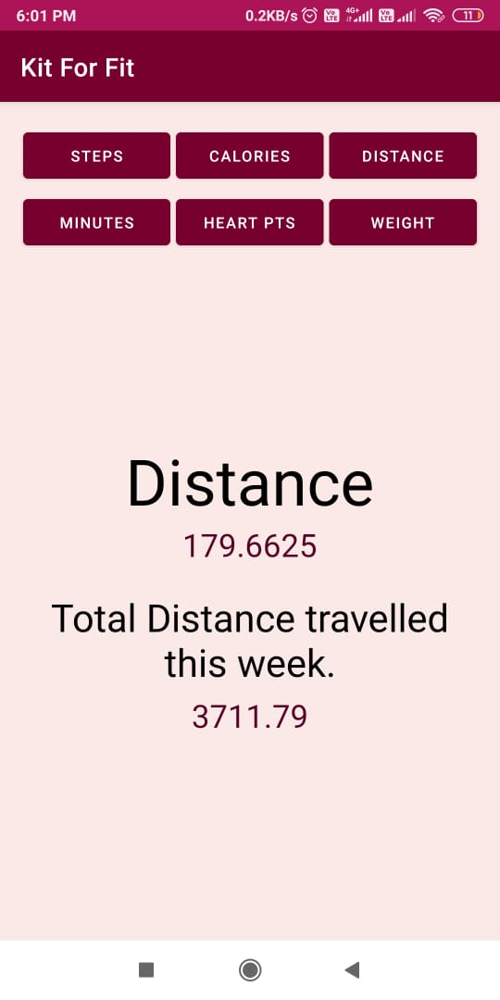

# Kit For Fit - Health Tracking Android App
I have created this app as a POC during my internship starting phase. 
It fetches user’s data from google fitness cloud with the help of Fitness APIs (only after user's consent).

This app follows MVVM (Model-View-ViewModel) architecture. 
I have not added Runtime Permissions at this time, it only takes oAuth Permissions from the user.

This app tracks your today's data and the past week data of the following parameters:
1. Step Counts
2. Calories Expended
3. Distance Travelled 
4. Active Move Minutes
5. Heart Points earned
6. Weight

MAIN SCREEN
|:-:|

| Steps Count | Calories Expended |  Distance Covered |
|:-:|:-:|:-:|
|  |  |  |

| Move Minutes | Heart Points |  Weight |
|:-:|:-:|:-:|
|  |  |  |

Project purpose is to fetch data from Fitness APIs', not UI 😄.

RESOURCES/REFERENCES:
+ [Google Fit Tutorial](https://developers.google.com/fit/)
